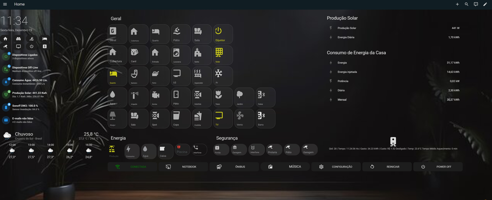

\# 🏠 Home Assistant Dashboard (Setup Real)


Dashboard real de \*\*Home Assistant\*\*, usada diariamente em ambiente de produção e apresentada no meu canal do YouTube.


[](https://youtu.be/I6ezCRUxces)


Este repositório \*\*NÃO é um template genérico\*\*.  

Ele mostra uma dashboard \*\*real\*\*, com imagens, sons, cards personalizados e integrações usadas no dia a dia.


---


\## 📸 Preview da Dashboard





> Captura real da dashboard rodando em um PC dedicado.


---


\## 🎯 Objetivo deste repositório


\- Compartilhar uma \*\*dashboard real\*\*

\- Servir como \*\*referência visual e estrutural\*\*

\- Ajudar quem quer:

&nbsp; - Criar dashboards modernas

&nbsp; - Usar imagens e sons locais

&nbsp; - Integrar mídia, rádio, energia e automação

&nbsp; - Montar setups com wallpanel


⚠️ Nem todos os dispositivos vão funcionar em outros ambientes — isso é esperado.


---


\## ⚙️ Estrutura do Projeto


home-assistant-dashboard/

├── dashboard.yaml

└── config/

└── www/

├── images/ # Imagens gerais

├── radio/ # Logos e fundos de rádios

├── play/ # Botões play / pause / volume

├── sounds/ # Sons usados na UI e automações

└── tela.jpg # Screenshot da dashboard


yaml

Copiar código


---


\## 🧩 Cards Utilizados


\- `custom:button-card`

\- `horizontal-stack`

\- `vertical-stack`

\- `picture-elements`

\- `media-control`

\- `entities`

\- `grid`


---


\## 🎨 Estilo e Interface


\- Imagens locais (`/local/...`)

\- Sons personalizados

\- Layout pensado para:

&nbsp; - PC

&nbsp; - Tablet

&nbsp; - Wallpanel


---


\## 🔌 Integrações Utilizadas (referência)


> Algumas integrações \*\*não funcionarão sem adaptação\*\*.


\- Browser Mod

\- Wallpanel

\- Hass Agent

\- Media Players

\- Integrações de energia

\- Sensores personalizados

\- MQTT

\- Hoymiles / Solar

\- Rádio online


---


\## 🖼️ Imagens


Todas as imagens ficam em:


config/www/


perl

Copiar código


Uso no Home Assistant:


```yaml

image: /local/painelwallper.jpg

🔊 Sons

Os sons estão organizados em:


arduino

Copiar código

config/www/sounds/

Exemplo de uso em automações:


yaml

Copiar código

media\_content\_id: /local/sounds/click.mp3

media\_content\_type: music

⚠️ Avisos Importantes

Este projeto não é plug-and-play


Entidades (switch, sensor, media\_player) são específicas do meu ambiente


Use como:


Referência


Base visual


Inspiração


👉 Se uma entidade não existir no seu Home Assistant, ela simplesmente não funcionará.


🛠️ Como adaptar para o seu Home Assistant

Copie apenas os cards que deseja


Substitua as entidades pelas suas


Ajuste os caminhos das imagens


Instale as integrações via HACS


Reinicie o Home Assistant


📺 Canal no YouTube

Todo o processo de criação dessa dashboard é mostrado no canal:


🎥 Home Assistant PC


Em breve:


Vídeos explicando cada seção


Como adaptar para outros ambientes


Otimização para tablet e wallpanel


🤝 Contribuições

Este projeto é pessoal, mas ideias e sugestões são bem-vindas.


Se isso te ajudou, ⭐ no repositório já fortalece muito.


📄 Licença

Uso livre para estudo e adaptação pessoal.


yaml

Copiar código


\# ⬆️ \*\*FIM DO README\*\* ⬆️


---


\## ✅ COMANDOS FINAIS (SEM INVENTAR)


Dentro da pasta do repositório:


```bat


